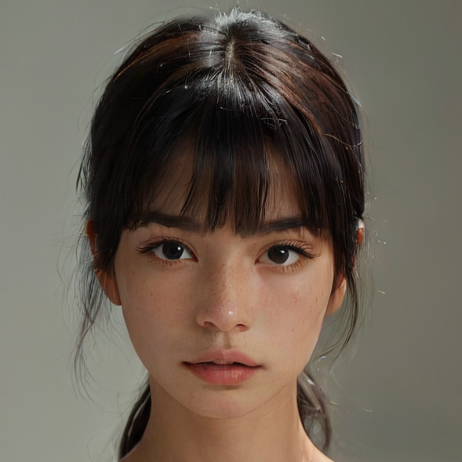
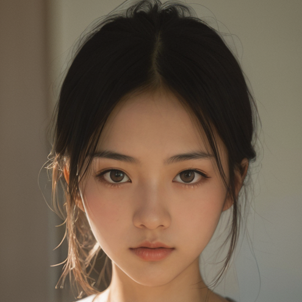
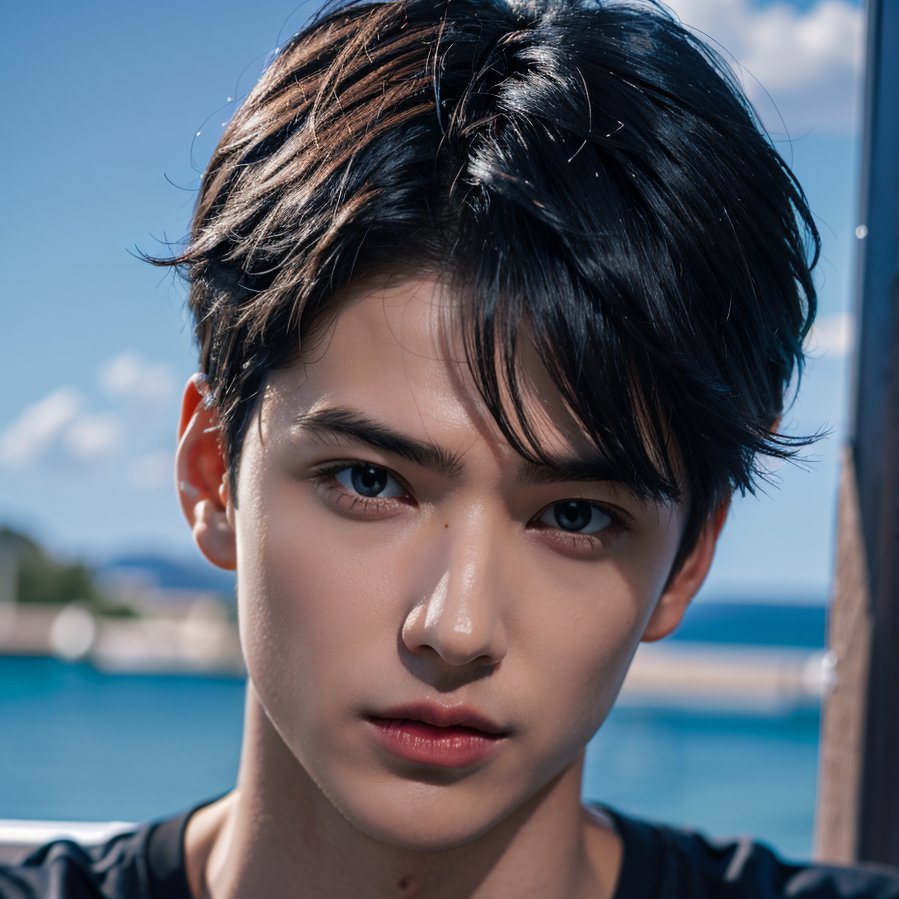

# Main Pipeline

## Extract the Head Region

### Prepare Your Image

Using the image at [this URL](https://civitai.com/images/1022064) as an example:


### Crop Out the Face Part

Ensure that the head is centered in the image, not too large or too small, as shown in the following image:



### Prepare Your Audio

#### Generate or Prepare an Audio File
Use a TTS tool to generate or prepare your own audio file.

We recommend using [edge-tts](https://github.com/rany2/edge-tts) with the `en-US-AriaNeural` voice, as it pairs well with our model. Here is an example script:
```
edge-tts --voice en-US-AriaNeural  --text  "In the mosaic of life, each moment weaves itself into a grand tapestry, one that captures not just our highest peaks but also our lowest valleys. This intricate interplay of experiences shapes our wisdom and resilience. As we journey through life, we realize that our true wealth lies not in material possessions but in the richness of our relationships and the depth of our reflections. Life, then, is less about what we accumulate and more about what we discover within ourselves and share with others." --write-media /path/to/your/audio/path/audio_name.wav --write-subtitles /path/to/your/audio/path/audio_name.vtt
```

### Run the inference 


[Source](https://civitai.com/images/6525430)

```
python ./code/demo.py \
    --infer_type 'hubert_full_control' \
    --stage1_checkpoint_path 'ckpts/stage1.ckpt' \
    --stage2_checkpoint_path 'ckpts/stage2_full_control_hubert.ckpt' \
    --test_image_path 'test_demos/portraits/aiface3.png' \
    --test_audio_path 'test_demos/audios/speech4.wav' \
    --test_hubert_path 'test_demos/audios_hubert/speech4.npy' \
    --result_path 'outputs/pipeline_samples/' \
    --face_sr
```


[1. Result (with face super-resolution)](../outputs/pipeline_samples/aiface3-speech4_SR.mp4)

[2. Result (without face super-resolution)](../outputs/pipeline_samples/aiface3-speech4.mp4)


### Other samples 1




```
python ./code/demo.py \
    --infer_type 'hubert_full_control' \
    --stage1_checkpoint_path 'ckpts/stage1.ckpt' \
    --stage2_checkpoint_path 'ckpts/stage2_full_control_hubert.ckpt' \
    --test_image_path 'test_demos/portraits/aiface4.png' \
    --test_audio_path 'test_demos/audios/speech4.wav' \
    --test_hubert_path 'test_demos/audios_hubert/speech4.npy' \
    --result_path 'outputs/pipeline_samples/' \
    --face_sr
```

[1. Result (with face super-resolution)](../outputs/pipeline_samples/aiface4-speech4_SR.mp4)

[2. Result (without face super-resolution)](../outputs/pipeline_samples/aiface4-speech4.mp4)


### Other samples 2



[Source](https://civitai.com/images/1520359)

```
python ./code/demo.py \
    --infer_type 'hubert_full_control' \
    --stage1_checkpoint_path 'ckpts/stage1.ckpt' \
    --stage2_checkpoint_path 'ckpts/stage2_full_control_hubert.ckpt' \
    --test_image_path 'test_demos/portraits/aiface1.png' \
    --test_audio_path 'test_demos/audios/speech4.wav' \
    --test_hubert_path 'test_demos/audios_hubert/speech4.npy' \
    --result_path 'outputs/pipeline_samples/' \
    --face_sr
```


[1. Result (with face super-resolution)](../outputs/pipeline_samples/aiface1-speech4_SR.mp4)

[2. Result (without face super-resolution)](../outputs/pipeline_samples/aiface1-speech4.mp4)
