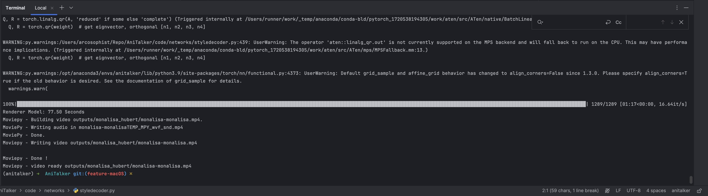
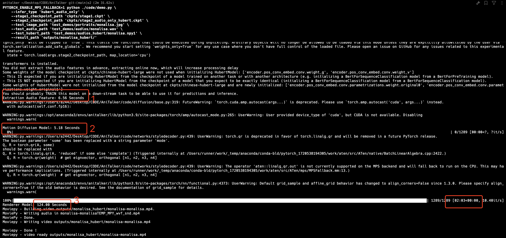

# AniTalker macOS Setup Guide

## Tested Environments

We have successfully tested the environment on the following devices:

- MacBook Pro M3 Max (128GB RAM, 8TB Storage), macOS Sonoma 14.6.1
- MacBook Pro M1 Pro (16GB RAM, 2TB Storage), macOS Sonoma 14.5

**Note:** We currently lack access to an Intel-based Mac. If you have one available, we warmly welcome your contributions regarding the testing environment and results.

## 1. Project Download

Clone the repository:

```bash
git clone https://github.com/X-LANCE/AniTalker.git
```

## 2. Dependencies Installation

Follow these steps to set up your environment:

```bash
# Create and activate a Conda environment
conda create -n anitalker python=3.9.0 -c conda-forge
conda activate anitalker

# Install PyTorch
conda install pytorch torchvision torchaudio -c pytorch

# Install ESPnet
git clone https://github.com/espnet/espnet.git
cd espnet
git checkout b10464
pip install -e .

# Install additional dependencies
conda install -c conda-forge pytorch-lightning=1.6.5 torchmetrics=0.5.0 transformers=4.19.2 moviepy numpy tokenizers scipy tqdm libffi
pip install python_speech_features

# [Optional] Install Rust if you encounter warnings
# curl --proto '=https' --tlsv1.2 -sSf https://sh.rustup.rs | sh
```

If you encounter issues during installation, please refer to our detailed environment files:
- [Conda environment file](../md_docs/mac_os_env_list/conda_environment.yml)
- [Pip requirements file](../md_docs/mac_os_env_list/pip_requirements.txt)

## 3. Model Download

Please follow the instructions in the `README.md` file to download all required models, including the HuBERT model.

## 4. Running the Demo

Execute the following command to run the demo:

```
 PYTORCH_ENABLE_MPS_FALLBACK=1 python ./code/demo.py \
    --infer_type 'hubert_audio_only' \
    --stage1_checkpoint_path 'ckpts/stage1.ckpt' \
    --stage2_checkpoint_path 'ckpts/stage2_audio_only_hubert.ckpt' \
    --test_image_path 'test_demos/portraits/monalisa.jpg' \
    --test_audio_path 'test_demos/audios/monalisa.wav' \
    --test_hubert_path 'test_demos/audios_hubert/monalisa.npy' \
    --result_path 'outputs/monalisa_hubert/'
```

### Results

- MacBook Pro M3 Max (128GB RAM, 8TB Storage), macOS Sonoma 14.6.1:
  

- MacBook Pro M1 Pro (16GB RAM, 2TB Storage), macOS Sonoma 14.5:
  

## 5. Notable Modifications

To ensure compatibility with macOS, we've made the following adjustments:

1. Updated dependencies in `requirements.txt`
2. Utilized MPS (Metal Performance Shaders) instead of CUDA for GPU acceleration
3. Changed data types from `float64` to `float32` for better performance
4. Added `PYTORCH_ENABLE_MPS_FALLBACK=1` environment variable to enable fallback to CPU when necessary


- Macbook pro M1 Pro (16GB + 2TB), Sonoma 14.5:


# 5. Modify log

- dependencies: requirements.txt
- use mps insted of cuda
- change float64 to float32
- PYTORCH_ENABLE_MPS_FALLBACK=1
