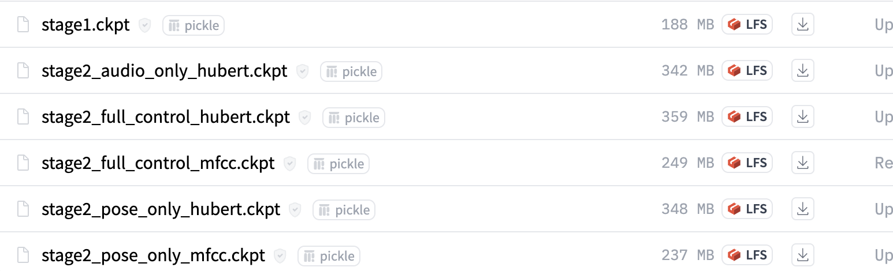
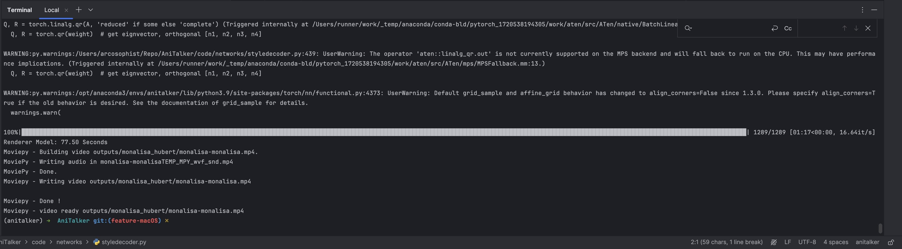

Successfully run on Macbook pro M3 Max (128GB + 8TB), Sonoma 14.6.1

# 1. Project Download

```
git clone https://github.com/X-LANCE/AniTalker.git  
```

# 2. Dependencies Installation

```
conda create -n anitalker python==3.9.0 -c conda-forge 
conda activate anitalker 
conda install pytorch torchvision torchaudio -c pytorch 
# install espnet 
git clone https://github.com/espnet/espnet.git 
cd espnet 
pip install -e . 
pip install python_speech_features 
conda install libffi
# You may downgrade pip to 24.0 if you receive warnings.
# python -m pip install --upgrade pip==24.0
# curl --proto '=https' --tlsv1.2 -sSf https://sh.rustup.rs | sh
pip install -r requirements_macOS.txt 
```

# 3. Assets Download

```
# Model  
cd AniTalker 
mkdir ckpts 
Go to https://huggingface.co/taocode/anitalker_ckpts/tree/main  
then download all six models in path ~/AniTalker/ckpts/ 

# npy Go to https://huggingface.co/datasets/taocode/anitalker_hubert_feature_samples/blob/main/monalisa.npy  
then download monalisa.npy in path ~/AniTalker/test_demos/audios_hubert/ 
```


# 4. Run

```
 PYTORCH_ENABLE_MPS_FALLBACK=1 python ./code/demo.py \   
    --infer_type 'hubert_audio_only' \    
    --stage1_checkpoint_path 'ckpts/stage1.ckpt' \    
    --stage2_checkpoint_path 'ckpts/stage2_audio_only_hubert.ckpt' \    
    --test_image_path 'test_demos/portraits/monalisa.jpg' \    
    --test_audio_path 'test_demos/audios/monalisa.wav' \    
    --test_hubert_path 'test_demos/audios_hubert/monalisa.npy' \    
    --result_path 'outputs/monalisa_hubert/' 
```


# 5. Modify log

- dependencies: requirements.txt
- use mps insted of cuda
- change float64 to float32
- PYTORCH_ENABLE_MPS_FALLBACK=1
